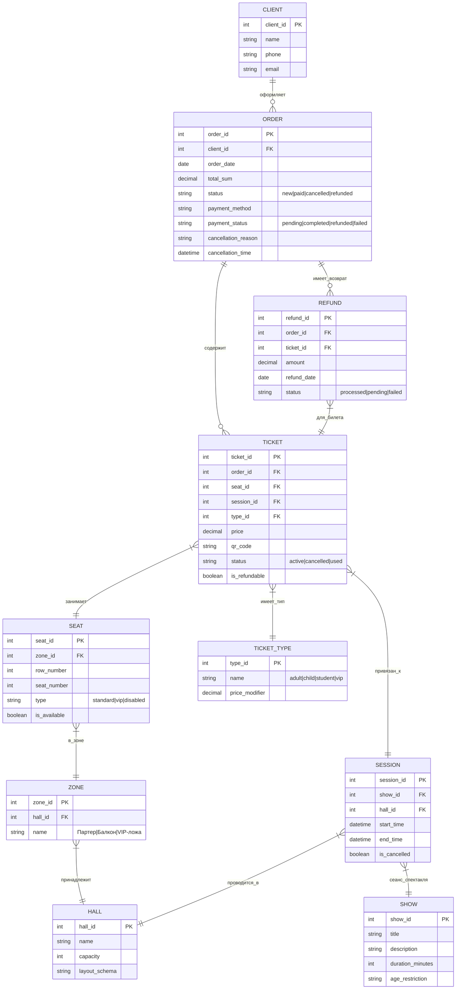

```mermaid
erDiagram
    CLIENT {
        int client_id PK
        string name
        string phone
        string email
    }
    
    ORDER {
        int order_id PK
        int client_id FK
        date order_date
        decimal total_sum
        string status "new|paid|cancelled|refunded"
        string payment_method
        string payment_status "pending|completed|refunded|failed"
        string cancellation_reason
        datetime cancellation_time
    }
    
    TICKET {
        int ticket_id PK
        int order_id FK
        int seat_id FK
        int session_id FK
        int type_id FK
        decimal price
        string qr_code
        string status "active|cancelled|used"
        boolean is_refundable
    }
    
    SEAT {
        int seat_id PK
        int zone_id FK
        int row_number
        int seat_number
        string type "standard|vip|disabled"
        boolean is_available
    }
    
    ZONE {
        int zone_id PK
        int hall_id FK
        string name "Партер|Балкон|VIP-ложа"
    }
    
    HALL {
        int hall_id PK
        string name
        int capacity
        string layout_schema
    }
    
    SESSION {
        int session_id PK
        int show_id FK
        int hall_id FK
        datetime start_time
        datetime end_time
        boolean is_cancelled
    }
    
    SHOW {
        int show_id PK
        string title
        string description
        int duration_minutes
        string age_restriction
    }
    
    REFUND {
        int refund_id PK
        int order_id FK
        int ticket_id FK
        decimal amount
        date refund_date
        string status "processed|pending|failed"
    }
    
    TICKET_TYPE {
        int type_id PK
        string name "adult|child|student|vip"
        decimal price_modifier
    }

    CLIENT ||--o{ ORDER : "оформляет"
    ORDER ||--o{ TICKET : "содержит"
    ORDER ||--o{ REFUND : "имеет_возврат"
    TICKET }|--|| SEAT : "занимает"
    TICKET }|--|| SESSION : "привязан_к"
    TICKET }|--|| TICKET_TYPE : "имеет_тип"
    SEAT }|--|| ZONE : "в_зоне"
    ZONE }|--|| HALL : "принадлежит"
    SESSION }|--|| HALL : "проводится_в"
    SESSION }|--|| SHOW : "сеанс_спектакля"
    REFUND }|--|| TICKET : "для_билета"
```
