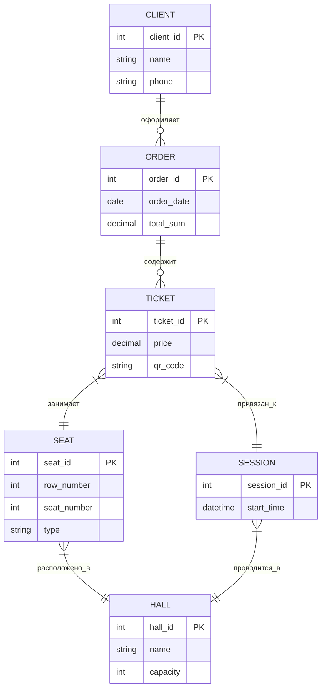

```mermaid
erDiagram
    CLIENT {
        int client_id PK
        string name
        string phone
    }
    CLIENT ||--o{ ORDER : "оформляет"
    
    ORDER {
        int order_id PK
        date order_date
        decimal total_sum
    }
    ORDER ||--o{ TICKET : "содержит"
    
    TICKET {
        int ticket_id PK
        decimal price
        string qr_code
    }
    TICKET }|--|| SEAT : "занимает"
    TICKET }|--|| SESSION : "привязан_к"
    
    SEAT {
        int seat_id PK
        int row_number
        int seat_number
        string type
    }
    SEAT }|--|| HALL : "расположено_в"
    
    HALL {
        int hall_id PK
        string name
        int capacity
    }
    
    SESSION {
        int session_id PK
        datetime start_time
    }
    SESSION }|--|| HALL : "проводится_в"
```
